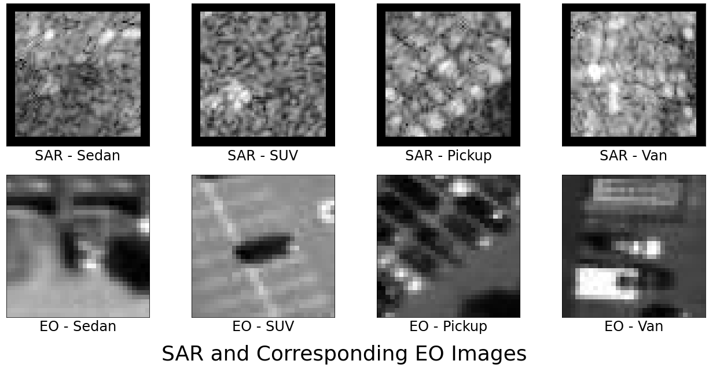
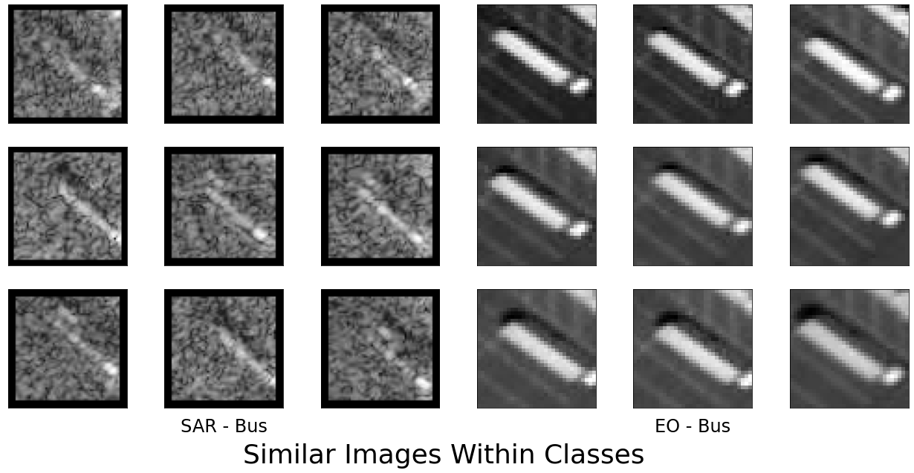
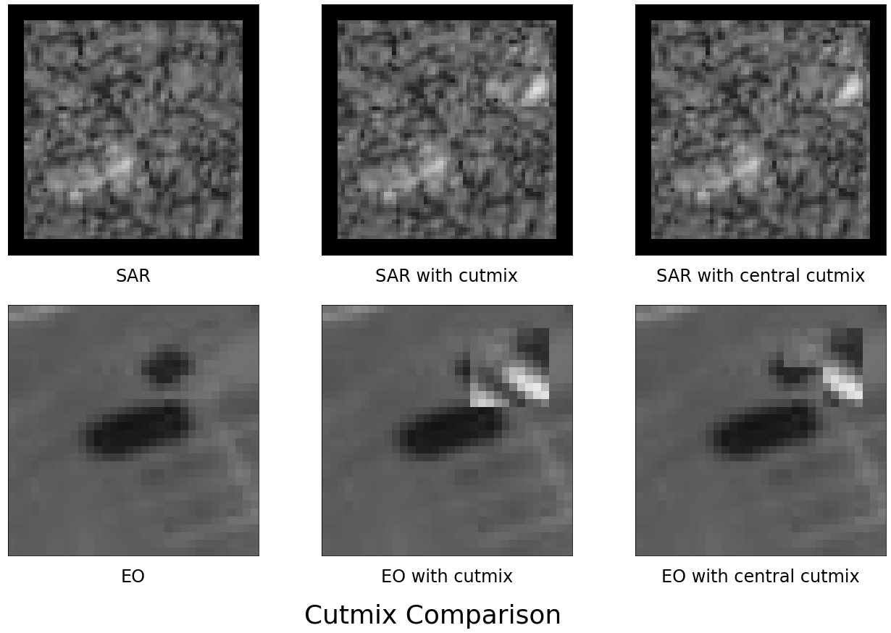
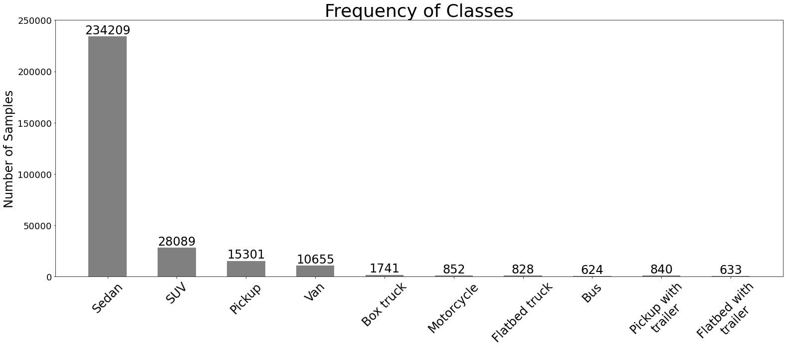

# Improving Training Strategies for SAR Image Classification
3rd place solution for the NTIRE 2021 Multi-modal Aerial View Object Classification Challenge - Track 1 (SAR) at CVPRW 2021  
[[Challenge Site]](https://competitions.codalab.org/competitions/28123) 
[[Challenge Paper]](https://arxiv.org/abs/2107.01189) 
[[Challenge Award]](https://data.vision.ee.ethz.ch/cvl/ntire21/NTIRE2021awards_certificates.pdf#page=27) 

## Overview
Recent advancemenets in deep learning have allowed for efficient and accurate classification of electro-optical (EO) images. However, classification of synthetic-aperature radar (SAR) images lag in accuracy. The objective of the challenge is to classify SAR image chips of vehicles into 10 classes, and this work showcases the strategies used to boost performance.

### Methodology
1. Addressing low resolution inputs  
The SAR image chips from the dataset have variable lengths of 54 to 60 pixels per side; small image sizes limit the amount of information that each image chip contains. Accuracy on small targets decreases when inputs are downsampled early on in networks, thus the stride of the convolutional layer within the stem block is changed from two to one.  
  


2. Addressing limited dataset size  
The dataset consists of samples that are alike, which limit the intraclass variation. To compensate, networks are pretrained on ImageNet. However, the stem block is excluded from pretraining due to the difference in stride and the inputs having a single channel as opposed to three.  
  

  
A center-preserving Cutmix modification coined **Central Cutmix** is employed alongside traditional flipping and rotations to introduce variation during training.
  


3. Addressing class imbalance  
The classes within the dataset exhibit a large imbalance, where the majority of samples are from the "sedan" class. To ensure a balanced performace, classes are under-sampled to approximately 1400 samples per class during training, which is approximately 80% of the number of "box truck" samples.  
  


### Results
|MobileNet|Cutmix|Central cutmix|Stem stride=1|Cosine annealing|Accuracy <br />valid data|Accuracy <br />test data|
|:-:|:-:|:-:|:-:|:-:|:-:|:-:|
|V2|||||15.58||
|V2|x||||16.88||
|V2||x|||18.05||
|V3-Large||x|||18.96||
|V3-Large||x|x||21.56||
|V3-Large||x|x|x|22.34|26.39|

## Usage
### Dependencies
- numpy
- pandas
- pillow
- pytorch
- pyyaml
- torchvision
- tqdm

### Downloading and Preprocessing Data

```bash
cd ./setup/
bash setup.bash
```
### Training
```bash
cd ./ntire2021/
python train.py
```
- changing the save_dir path in config_train.yml allows for changing the location of the directory that the newly trained model will be saved to

### Predicting
```bash
cd ./ntire2021/
python predict.py
```

- changing the save_dir path in config_predict.yml allows for changing the location of the directory that the prediction csv file will be saved to

## Citation
If you find this work useful in your research or publication, please cite this work:
```TeX
@article{liu2021_nti,
  author={Liu, Jerrick and Inkawhich, Nathan and Nina, Oliver and Timofte, Radu and Jain, Sahil and Lee, Bob and Duan, Yuru and Wei, Wei and Zhang, Lei and Xu, Songzheng and Sun, Yuxuan and Tang, Jiaqi and Geng, Xueli and Ma, Mengru and Li, Gongzhe and Geng, Xueli and Cai, Huanqia and Cai, Chengxue and Cummings, Sol and Miron, Casian and Pasarica, Alexandru and Yang, Cheng-Yen and Hsu, Hung-Min and Cai, Jiarui and Mei, Jie and Yeh, Chia-Ying and Hwang, Jenq-Neng and Xin, Michael and Shangguan, Zhongkai and Zheng, Zihe and Yifei, Xu and Yang, Lehan and Xu, Kele and Feng, Min},
  title={NTIRE 2021 Multi-modal Aerial View Object Classification Challenge},
  publisher={arXiv},
  year={2021},
  doi={10.48550/ARXIV.2107.01189},
  url={https://arxiv.org/abs/2107.01189},
}
```
